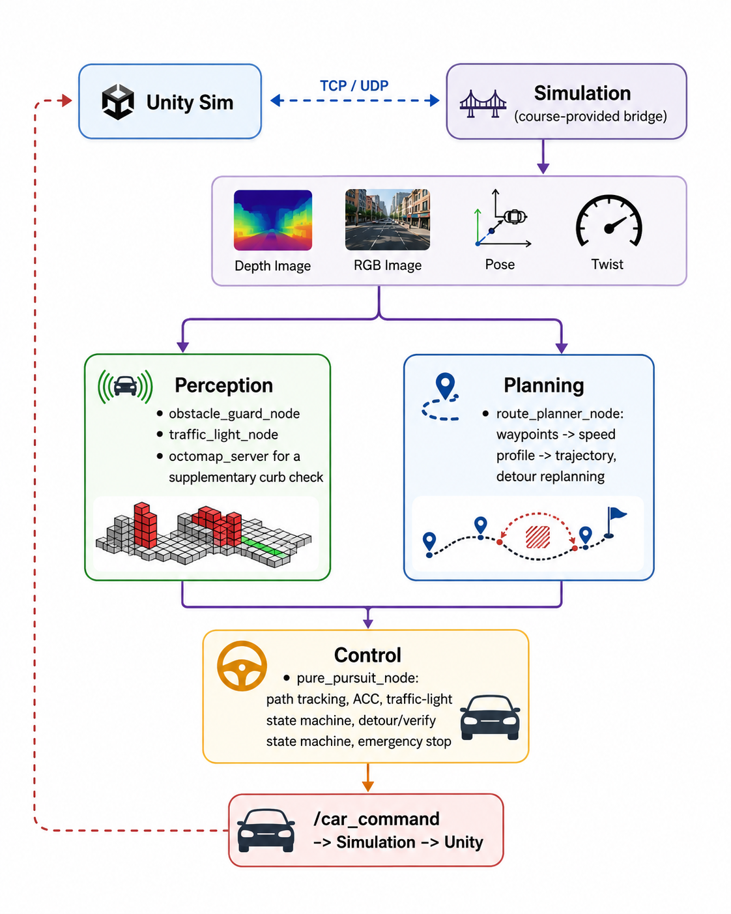
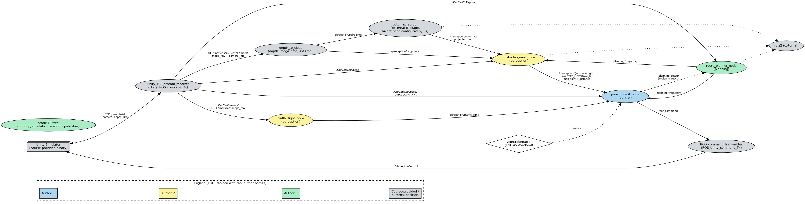
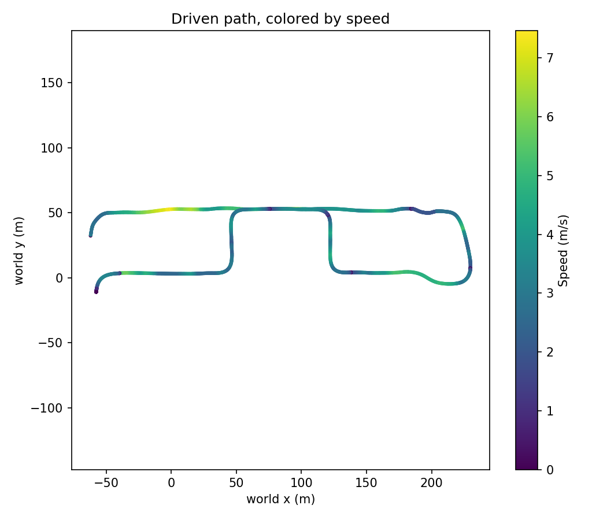
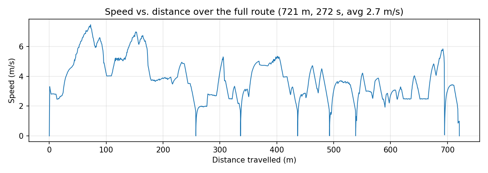
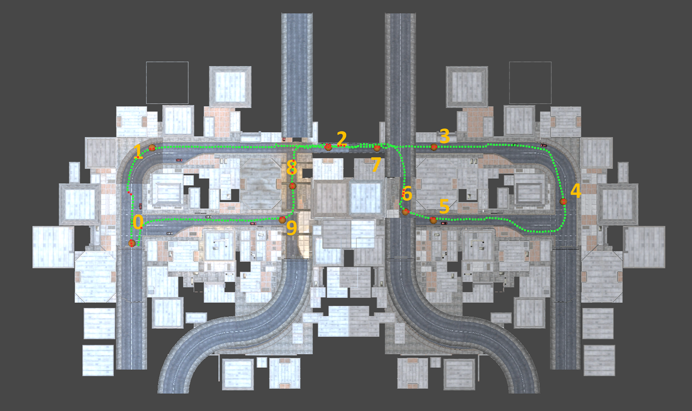

# Autonomous Driving Project — Documentation

TUM "Introduction to ROS" 2026 — Autonomous Driving group project.

This document explains the architecture, design decisions, external
dependencies, known limitations, and results of our submission. See the
[repository README](../README.md) for install/build/run instructions, and
[`DEEP_DIVE.md`](DEEP_DIVE.md) for the full engineering-detail version of
everything below (every algorithm, every parameter's exact value and the
reasoning behind it, a complete bug history, and the performance/testing
methodology).

## 1. System Overview

The car drives a fixed ~785 m urban loop published once at startup from a
pre-recorded, lane-snapped set of waypoints. Five ROS 2 packages we wrote
ourselves sit on top of two packages provided by the course (`simulation`,
the Unity TCP/UDP bridge, and `dummy_controller`, an unused reference
example) and several external ROS libraries:

*Perception and planning consume the simulator's sensor/pose streams
independently and run in parallel; `control` is the only node that
combines their outputs and is the sole path to `/car_command` — no other
node talks to the simulator directly.*

A single launch file (`bringup/main.launch.py`) starts every node, the
static TF tree, and RViz. See Section 3 for the full, auto-generated ROS
graph.

## 2. Packages and Nodes

| Package | Owner (EDIT) | Node(s) | Responsibility |
|---|---|---|---|
| `simulation` | *course-provided* | `unity_TCP_stream_receiver`, `ROS_command_transmitter` | TCP/UDP bridge to Unity: publishes ground-truth pose/twist, camera/IMU data; sends `VehicleControl` commands. Ported to ROS 2 Jazzy, not otherwise modified. |
| `dummy_controller` | *course-provided* | — | Minimal example controller from the course. Not used by `bringup`; kept only for reference. |
| `project_interfaces` | Author 1 | — | Our custom message types: `Trajectory`/`TrajectoryPoint` (planned path with per-point speed) and `TrafficLight` (detected signal state). |
| `perception` | Author 2 | `obstacle_guard_node` | Transforms the depth-camera point cloud into the world frame and measures arc-length distance to the nearest obstacle along the planned trajectory in four corridors (main/tight/overtake-left/overtake-right), plus an OctoMap cross-check for curb-height obstacles the live scan misses (Section 2.3). |
| `perception` | Author 2 | `traffic_light_node` | RGB HSV blob detection of the facing signal head. Deliberately does **not** use the semantic camera (bonus criterion). |
| `planning` | Author 3 | `route_planner_node` | Builds a lane-snapped, curvature-limited-speed trajectory from the recorded waypoints; reactively replans a lateral detour around a confirmed static obstacle; selects the nearest still-ahead goal from the task's predefined pose list. |
| `control` | Author 1 | `pure_pursuit_node` | Pure-pursuit path tracking, ACC (Adaptive Cruise Control)-style gap control, traffic-light stop/go state machine, detour engage/verify/thread/hold state machine, emergency braking. Implements the required `/control/enable` service. |
| `bringup` | Author 3 | — | Single launch file, static TF tree (sensor extrinsics per the task sheet's vehicle drawing), RViz config. |

### 2.1 Perception

`obstacle_guard_node` receives the depth camera's point cloud (converted to
`sensor_msgs/PointCloud2` by the external `depth_image_proc` component),
transforms every point into the world frame via `tf2`, and classifies each
against the closest segment of the currently-planned trajectory. Points
with world height in `[0.35, 3.0]` m are kept (below that is road-surface
noise and low sidewalk fringes); four corridor distances are published,
including a `tight` corridor used both for ACC following and for verifying
a detour path is actually clear before committing to it.

`traffic_light_node` classifies connected components in an HSV-thresholded
mask of the facing camera image, filtering blobs by shape (compact,
roughly square, well-filled) to reject false positives such as the red
ring of no-U-turn signs or red shop banners. Only red and green are
detected — the amber phase is skipped because the signal casing is itself
amber-painted metal and cannot be reliably separated from a lit amber
lamp; the controller treats "stopped, no fresh green yet" as "keep
waiting," which is compliant behaviour.

No node in this pipeline — perception, planning, or control — subscribes
to the semantic camera at any stage; every signal used here comes from
the depth point cloud, RGB HSV thresholding, or the accumulated
OctoMap, claiming the rubric's full no-semantic-camera bonus.

### 2.2 Planning

#### 2.2.1 Base Path Generation

`route_planner_node` loads the recorded waypoints and, once at startup,
builds a fixed *base path*: a right-hand lane offset (so the car drives
its own side of the road instead of straddling the recorded centreline,
tuned per-stretch to available road width and eased out in sharp turns to
avoid curbs or junction edges), iterative smoothing (removes jaggedness
that would otherwise read as artificially tight curvature), and a
curvature- and acceleration-limited speed profile (tighter curves get a
lower limit; braking/accelerating passes in each direction cap how fast
speed can change between consecutive points). The resulting path —
position, heading, curvature, and speed per point — is published once as
the planner's live trajectory. This covers both the task's optional
*path planner* role (the geometric lane-offset path, ignoring
kinematics) and its required *trajectory planner* role (the following
speed profile, where curvature and acceleration limits enforce the
task's kinematic/dynamic constraints).

#### 2.2.2 Detour Replanning and Goal Selection

On top of the static base path, `route_planner_node` handles two on-line
updates: obstacle detours requested by `control`, and continuous
short-term goal selection over the task's predefined pose list.

When `control` confirms a static obstacle, the planner shifts a short
stretch of the base path sideways just enough to clear it, blending
smoothly back into the original line on either side (no abrupt lateral
jump), then reverts once the obstacle is reported clear. It locates the
affected stretch by binary-searching the path's arc-length ordering
rather than rescanning the whole route, and re-runs the detoured section
through the same speed profile as the base path.

Independently, the planner tracks vehicle progress and publishes the
nearest still-ahead goal from the task's predefined pose list. Because
the route loops back near itself, a plain nearest-point search would be
ambiguous between two nearby but unrelated points; the planner resolves
this once at startup with a heading-filtered search that locks onto the
correct pass, then stays locked on with a cheaper position-windowed local
search.

### 2.3 Control

`pure_pursuit_node` tracks the published trajectory with a standard
pure-pursuit lateral law (steering from a geometric look-ahead point
`Ld = 3.0 + 0.5*v` m, wheelbase 2.63 m per the task sheet's Fig. 3, not
a PID error term [2]) and a throttle law combining proportional
correction with a feed-forward table — added because a plain
proportional law alone settles 0.7–2 m/s below its commanded speed at
steady state against the simulator's own drag (`v_des` = 2.5 m/s
measured 1.84 m/s); the table is calibrated directly against that
measured gap. On top of that:

- **`/control/enable` service** (`std_srvs/SetBool`, the project's
  required self-implemented ROS service): `true` releases the brake and
  is the default at launch (`start_enabled:=true`) — the car drives as
  soon as it has a trajectory and a pose, no service call needed.
  Passing `start_enabled:=false` instead holds the brake for a
  supervised or precisely-timed start, released later by calling the
  service directly.
- **ACC-style gap control**: a tight-corridor comfort-stop curve
  (`sqrt(2*a_obstacle*(d-standoff))`, `a_obstacle` = 1.5 m/s², 13 m
  standoff) is the safety authority at all times; a wide-corridor
  approach cap layers on top, ramping 2.5–6.5 m/s between 14–38 m of
  anything ahead — replacing an earlier flat 2.5 m/s cap that measurably
  starved the whole route (roadside furniture occupies the wide corridor
  60–90% of route time). The same gap-following logic absorbs the
  task's Event I encounter (an NPC merging in after the first
  intersection) without a dedicated branch — a suddenly appearing
  vehicle is simply followed like any other traffic; only a vehicle that
  crosses and brakes hard directly ahead (Event II) needs the dedicated
  emergency-stop path below.
- **Traffic-light state machine** stops at the correct stop line for a red
  phase and releases on a confirmed green; a bounded blind-release timer
  covers the one junction (TL4) whose signal head leaves the camera's
  field of view right at the stop line — see Section 5 for the honest
  limitation here.
- **Obstacle detour state machine** (`kNormal -> kVerify -> kDetour`, with
  a `kHold` fallback) proactively replans around a static obstacle once
  confirmed parked (tracked as static vs. moving by watching its world
  position over a few seconds), verifies the shifted path is clear before
  committing, and threads it.
- **Emergency stop**: every control tick, independent of the above,
  computes the deceleration required to stop before the nearest raw
  corridor obstacle (`a = v^2 / (2 d)`) and immediately commands full
  brake if that exceeds `emergency_decel` (4.0 m/s², deliberately above
  the ACC comfort curve's 1.5 m/s² so an ordinary, already-slowed
  approach never trips it) — this is the task's Event II ("NPC crosses
  then brakes hard") handling.
- **Supplementary OctoMap cross-check**: `obstacle_guard_node` also
  publishes `/perception/map_tight_distance` from `octomap_server`'s
  accumulated occupancy map (height-banded to 0.08–0.35 m, the range the
  live per-frame filter ignores). `kVerify` ANDs this in: a fresh map hit
  can additionally veto a detour the live sensor alone approved (catching
  a curb the live sensor structurally can't see), but a stale/absent
  reading never blocks anything by itself. Two bounded-trust safeguards
  prevent an indefinite hold: the map signal is ignored if stale, and a
  map-only block can hold for at most 25 s before falling back to the
  live sensor alone.

## 3. ROS Graph

Generated directly from the launch file (not hand-drawn): nodes are
ellipses, topics are the labeled edges (direction = publisher →
subscriber), and color groups nodes by author, matching Section 2's
ownership column.

*(Author colors are placeholders — see the table in Section 2 for the
current mapping; replace with real names before submission.)*

## 4. Results

A full run of the finished system (`bringup/main.launch.py`, default
parameters, spawn position 0 — the task's designated final-benchmark
start — telemetry logged for these figures): **272 s, zero
collisions, zero stalls, one detour, two red-light stops handled
correctly** — the detour at the same static obstacle and TL2/TL3 each
requiring a stop-and-release have repeated identically across every
regression run this cycle. The route has four signal-controlled stop
points total (TL1–TL4, see Section 5); TL2/TL3 have consistently been red
on arrival, TL1/TL4 consistently green. Because phase-on-arrival depends
on the real-time sim clock at spawn, a differently-timed run could see a
different subset require a stop — the same stop/wait/release logic
(Section 2.3) applies regardless of which junction is red, so that would
be a different *subset firing*, not different documented behavior.

The route also includes the task's Event II encounter (a second vehicle
crossing then braking, met on the return leg): in every checked run it
appears at the same location (~s = 531), handled by the ACC gap-following
logic alone (speed easing to ~0.5 m/s, no stop, no emergency brake) — one
of the near-zero dips below. The dedicated emergency-stop branch is a
backstop for a faster-closing version of this encounter and has not
itself fired in testing.

- Average speed **2.7 m/s**, peak **7.5 m/s** on the two longest clear
  straights.

- `route_speed_map.png` (above): driven path colored by speed — dark
  (near-zero) points mark the detour, Event II, and the two light stops;
  speed peaks on the long straights.

- `speed_profile.png` (above): the same data vs. distance — five
  near-zero dips (detour wait, two ACC-managed slowdowns, two light
  stops), re-accelerating smoothly after each. The two ACC dips are
  Event II (~s = 531, confirmed) and, most likely, the task's Event I
  merge after the first intersection — unlike Event II, Event I was not
  separately isolated with photographic confirmation in this run.
- The distance-travelled axis reads **~721 m** vs. the route's documented
  ~785 m: a straight-line, point-to-point Euclidean sum over 10 Hz
  samples undercounts on curves (chord vs. arc) — a measurement artifact,
  not a shorter drive.

- `route_on_map.png` (above) shows the finished route overlaid on the
  course map, with the ten predefined goal poses (0–9) marked — the
  actual input to Section 2.2.2's goal-selection logic.

**Validation methodology**: every non-trivial change was followed by a
full-route regression run checked against a known baseline (route
completion, zero collisions, the same detour/traffic-light events firing
identically, no new log warnings); a fresh-machine build was
independently verified by replicating the README's clone →
`install_ros2_jazzy.sh` → `colcon build` sequence on a pristine
`ubuntu:24.04` Docker image — all 7 packages built with zero failures in
24.8 s — directly targeting the rubric's single largest penalty clause
(−30p for code that does not build or behave as documented).

## 5. Known Limitations / Requirements Not Fully Met

- **TL4 blind-release timing**: this junction's signal head is
  detectable only right at the stop line, so the car sometimes releases
  without a confirmed-fresh phase reading. The 22 s release-timer bound
  comes from the red-phase duration measured at TL1 (the only junction
  whose head stays visible long enough to time a full cycle) and is
  assumed, not independently confirmed, to also bound TL4 — TL4's own red
  duration can't be measured the same way. Even at face value, the red
  phase (22 s) exceeds the following green+amber window (14 s), so for
  any fixed-delay timer with no live visibility there exists an arrival
  offset where release lands inside the *next* red phase (worst case ~8 s
  unavoidable overlap) — a physical limitation of the intersection's
  timing, not something a control-side fix alone can eliminate.
- **OctoMap curb cross-check** (Section 2.3) is code-reviewed and
  bounded-safe (verified not to introduce false blocks/hangs across
  regression runs) but never actually triggered — this route's one
  obstacle isn't at curb height the live sensor misses. Included as a
  safety net for cases the live corridor structurally can't see, not
  because we observed it catch something.
- **Perception update rate** (~0.7 Hz for point-cloud-derived corridor
  distances) is bounded by Unity's own single-core render/physics loop —
  confirmed by measuring the corridor-publish rate at several look-ahead
  settings (0.73 Hz at 45 m vs. 0.67 Hz at 20 m, essentially unchanged)
  while Unity's render process stayed pinned at 99.5% CPU on a single
  core throughout, not fixable from the ROS side. This caps how much
  cruise speed can be raised before stale-corridor braking becomes
  frequent.

## 6. External Code / Not Written by Us

- `simulation`, `dummy_controller`: provided by the course (maintainers
  Markus Ryll, Jiaming Zhang), ported to ROS 2 Jazzy; not modified beyond
  what porting required.
- `depth_image_proc` (`PointCloudXyzNode`), `octomap_server`,
  `tf2_ros`, `rviz2`, `rclcpp`/`rclcpp_components`, `std_srvs`, `cv_bridge`,
  OpenCV: standard ROS 2 / third-party libraries, used as-is via their
  public APIs and launch-file parameters (not modified); see bibliography.
- Everything in `project_interfaces`, `perception`, `planning`, `control`,
  and `bringup`'s launch file / TF tree is written by us.

## 7. Team & Contributions

*(Placeholder — replace with real names.)*

| Author | Main contributions |
|---|---|
| Author 1 | `control` (`pure_pursuit_node`): path tracking, ACC, traffic-light and detour state machines, emergency stop, `/control/enable` service; `project_interfaces` message design |
| Author 2 | `perception` (`obstacle_guard_node`, `traffic_light_node`): corridor obstacle monitoring, OctoMap cross-check, HSV traffic-light detection |
| Author 3 | `planning` (`route_planner_node`): trajectory generation, detour replanning, goal selection; `bringup` (launch file, TF tree, RViz config) |

## References

1. Open Robotics, *ROS 2 Documentation — Jazzy Jalisco*, https://docs.ros.org/en/jazzy/, accessed 2026.
2. R. C. Coulter, "Implementation of the Pure Pursuit Path Tracking Algorithm," Carnegie Mellon University Robotics Institute, Tech. Rep. CMU-RI-TR-92-01, 1992.
3. A. Hornung, K. M. Wurm, M. Bennewitz, C. Stachniss, and W. Burgard, "OctoMap: An Efficient Probabilistic 3D Mapping Framework Based on Octrees," *Autonomous Robots*, 34(3), pp. 189–206, 2013.
4. `octomap_server` / `octomap_mapping`, OctoMap project, https://github.com/OctoMap/octomap_mapping.
5. `image_pipeline` / `depth_image_proc`, ROS Perception, https://github.com/ros-perception/image_pipeline.
6. R. B. Rusu and S. Cousins, "3D is Here: Point Cloud Library (PCL)," *IEEE International Conference on Robotics and Automation (ICRA)*, 2011.
7. G. Bradski, "The OpenCV Library," *Dr. Dobb's Journal of Software Tools*, 2000.
8. T. Foote, "tf: The Transform Library," *IEEE International Conference on Technologies for Practical Robot Applications (TePRA)*, 2013.
9. Open Robotics, *RViz Documentation*, https://github.com/ros-visualization/rviz.
10. Unity Technologies, *Unity Engine* (course-provided simulation binary).
11. TUM Chair of Autonomous Aerial Systems, *Introduction to ROS 2026 — Autonomous Driving Project* (task sheet), 2026.
